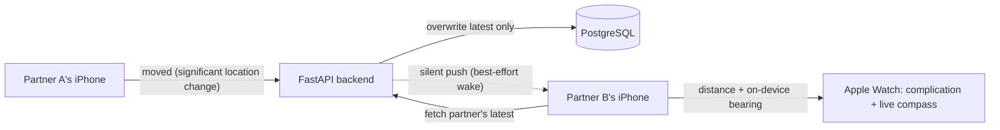

# hongyeon
Building a long-distance proximity app for couples in public — iOS + watchOS (SwiftUI) frontend, FastAPI + PostgreSQL backend, with Sign in with Apple. A capstone project documenting the full journey from idea to App Store.

# 홍연 (Hongyeon)

> A long-distance app for couples — see how far apart you are and which way to turn,
> glanceable right from your Apple Watch.

**Hongyeon** (홍연) takes its name from the East Asian legend of the *red thread of fate* —
the invisible red thread said to connect two people who are meant to be together. The whole
app is built around that image: a single thread stretching across the distance between two
people, showing not just *how far* apart you are, but *which direction* your person is.

> **Status: in active development.** This repo documents the build from first commit to
> App Store — architecture decisions, dead ends, and all. Star it to follow along.

<!-- TODO: add a screenshot / demo GIF of the watch complication once the UI exists -->
<!--  -->

---

## What it does

Most long-distance couples don't need a live map following each other around all day — that's
battery-hungry and a little invasive. Hongyeon aims for something calmer: **ambient awareness**.

- **A red thread on your wrist.** An Apple Watch complication shows the distance and direction
  to your partner at a glance — *"5 mi away · updated 12m ago."*
- **Low-power by design.** The phone reports location only when you meaningfully move, using
  Core Location's significant-location-change service instead of constant GPS polling.
- **A live compass for the last stretch.** When you're close and actively trying to find each
  other, opening the watch app gives a real-time arrow that points the way.
- **Mutual, revocable, forgetful.** Both people opt in, either can stop sharing anytime, and
  only the *most recent* location is ever stored — never a history.

## Why I'm building it

This is a portfolio capstone I'm building to learn end-to-end product engineering — not just
to ship an app, but to understand every layer of one. It deliberately spans the hard parts:

- **Background execution & OS limits** — reliably reporting location without draining the battery.
- **Event-driven backend architecture** — a small API that routes location events between two
  devices and fans out push notifications.
- **Native Apple frameworks** — SwiftUI across iOS *and* watchOS, WidgetKit complications,
  ActivityKit Live Activities, and Core Location.
- **Doing auth and infrastructure properly** — Sign in with Apple, push certificates, deployment.

## How it works

The iPhone is the reliable **broadcaster**; the Apple Watch is the glanceable **viewer**. The
backend is a thin event router that stores only each user's latest location and best-effort
notifies their partner.

A few deliberate engineering choices worth calling out:

- **Silent push is treated as a best-effort freshener, not a real-time guarantee** — iOS throttles
  it, so the UI always shows *"updated X ago"* rather than pretending to be live.
- **The direction arrow is computed on-device**, because it needs the viewer's live compass
  heading, which only the device has. The server computes distance; the watch owns direction.
- **Privacy is the architecture, not a setting** — the database schema physically can't hold a
  location history because each update overwrites the last.

## Tech stack

| Layer | Technology |
|---|---|
| iOS + watchOS | SwiftUI, WidgetKit, ActivityKit, Core Location |
| Backend | Python, FastAPI, async SQLAlchemy, Alembic |
| Database | PostgreSQL |
| Auth | Sign in with Apple + Google (with a custom session JWT) |
| Push | Apple Push Notification service (APNs) |
| Hosting | Render |
| Testing | pytest |

## Roadmap

Built in phases that front-load the riskiest, least-glamorous parts first.

- [ ] **Phase 0** — De-risk the core loop: location → backend → silent push → measure freshness
- [ ] **Phase 1** — Backend + account pairing (FastAPI, PostgreSQL, auth, 6-digit pairing codes)
- [ ] **Phase 2** — iOS location engine (significant-location-change reporting + permissions)
- [ ] **Phase 3** — APNs silent push fan-out
- [ ] **Phase 4** — watchOS app, complication, and distance/bearing math
- [ ] **Phase 5** — "You're close" Live Activity + live foreground compass
- [ ] **Phase 6** — Polish, WebSocket upgrade, iPhone widget, App Store submission

## Running locally

Setup instructions will be added here as the backend and clients come together. (Secrets are
kept out of the repo entirely — configuration is via a local `.env` that is never committed.)

## Following along

I'm documenting the whole journey — the reasoning behind each decision, not just the final code.
If that's interesting to you, the commit history is meant to be readable as a story.

## License

Released under the MIT License. See [`LICENSE`](LICENSE) for details.
